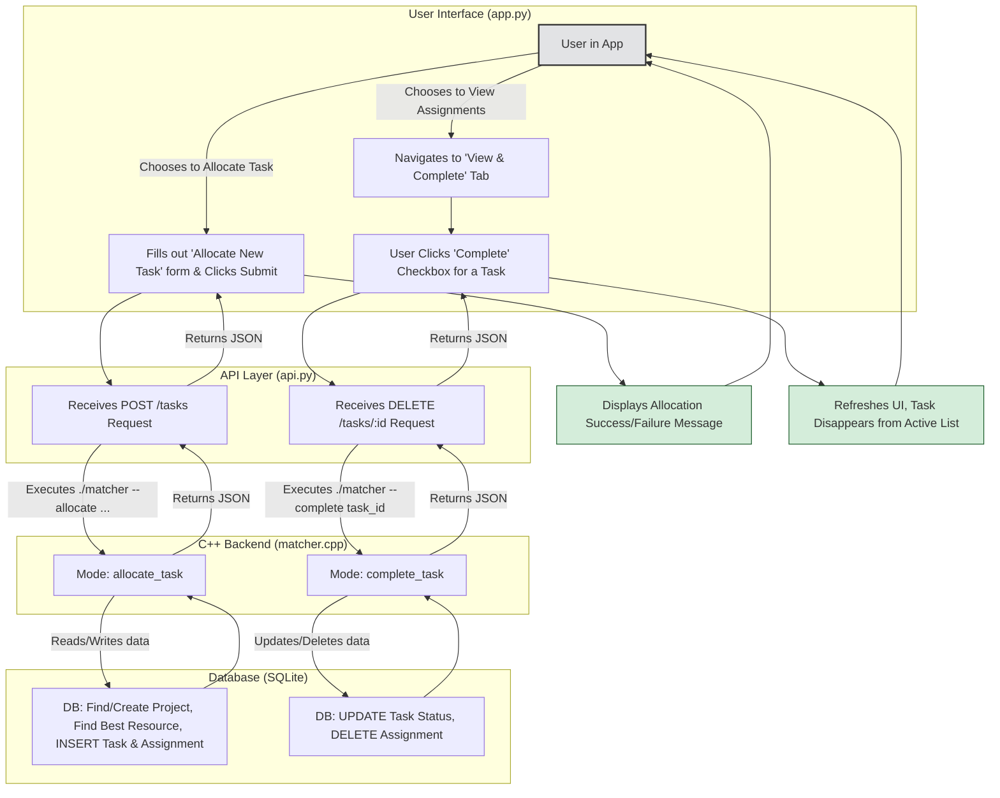

# Intelligent Task Manager

An advanced resource management and task allocation system featuring a high-performance C++ backend, a Python (SQLite) API layer, and an interactive web dashboard built with Streamlit.

This project demonstrates a multi-language, 3-tier architecture designed for smart task management. It goes beyond simple matching by implementing an intelligent algorithm that allocates new tasks to the most suitable resources based on skill, availability, and current workload.

---
## Key Features

* **3-Tier Architecture**: A clear separation of concerns with a Streamlit frontend (Presentation), a Python API (Business Logic), and a C++ backend (Core Logic/Data Layer) for maintainability and performance.
* **Intelligent Task Allocation**: A two-priority algorithm that first seeks completely free resources and then assigns tasks to the least busy qualified resource to optimize workload distribution.
* **Dynamic Task Management**: Managers can allocate new tasks, create new projects on the fly, and view active assignments in real-time.
* **Task Completion & History**: A workflow to mark tasks as complete, which instantly frees up resources for new assignments while preserving a historical record of all completed work.
* **Interactive Web Dashboard**: A user-friendly interface built with Streamlit that allows managers to interact with the system effortlessly.

---
## Architecture Diagram

The application follows a classic 3-tier architecture, ensuring that each component is independent and scalable.



## Steps to Run in Local

Follow these steps to get the project running on local machine.

### Prerequisites

You will need the following software installed on your system. These instructions are for Debian/Ubuntu-based Linux distributions.

* **C++ Compiler (g++)**
    ```sh
    sudo apt-get update
    sudo apt-get install build-essential g++
    ```
* **SQLite3 Development Library**
    ```sh
    sudo apt-get install libsqlite3-dev
    ```
* **Python 3 and Pip**
    ```sh
    sudo apt-get install python3 python3-pip
    ```
* **nlohmann/json C++ Library**
    Download the single header file into the project directory.
    ```sh
    wget [https://github.com/nlohmann/json/releases/download/v3.11.2/json.hpp](https://github.com/nlohmann/json/releases/download/v3.11.2/json.hpp)
    ```

### Setup and Installation

1.  **Clone the Repository**
    ```sh
    git clone <your-repository-url>
    cd <repository-directory>
    ```

2.  **Install Python Libraries**
    ```sh
    pip install -r requirements.txt
    ```

3.  **Compile the C++ Backend**
    Make the compilation script executable and run it. This will create the `matcher` program.
    ```sh
    chmod +x compile.sh
    ./compile.sh
    ```

### Running the Application

Run the API server and the Streamlit frontend in **two separate terminal windows**.

1.  **Start the Python API Server (Terminal 1)**
    This command starts the backend server, which will automatically create and set up the database using the C++ executable.
    ```sh
    python3 api.py
    ```
    You should see output indicating the server is running on port 8000.

2.  **Run the Streamlit Web App (Terminal 2)**
    This command starts the frontend web application.
    ```sh
    streamlit run app.py
    ```
    Streamlit will automatically open a new tab in your web browser with the application dashboard.


## Detailed Overview

### Project Structure

```text
├── app.py                  # The Streamlit frontend UI
├── api.py                  # The Python backend API (http.server)
├── matcher.cpp             # The C++ core logic for allocation and DB interaction
├── compile.sh              # A simple script to compile the C++ code
├── json.hpp                # The nlohmann JSON library for C++
└── resource_matching.db    # The SQLite database file (auto-generated)
```
### Functionality

The application is divided into four main tabs in the UI:

1.  **Project Task Matching**: This tab provides a view of *potential* matches. For any given project, it shows all tasks and lists every resource who has the required skill and whose general availability overlaps with the task's schedule. This is useful for high-level planning.

2.  **Allocate New Task**: This is the main interactive feature. A manager can define a new task, assign it to a new or existing project, specify the required skill, and set the estimated duration in hours. The C++ backend then runs its two-priority algorithm to find the best-fit resource and officially assign the task.

3.  **View & Complete Assignments**: This tab shows a real-time list of all *currently active* assignments. Next to each task is a checkbox that allows a manager to mark the task as complete, which frees up the resource instantly for new work.

4.  **Completion History**: To maintain a record of all work, this tab displays a historical log of all completed tasks, including which resource completed them and on what date.

