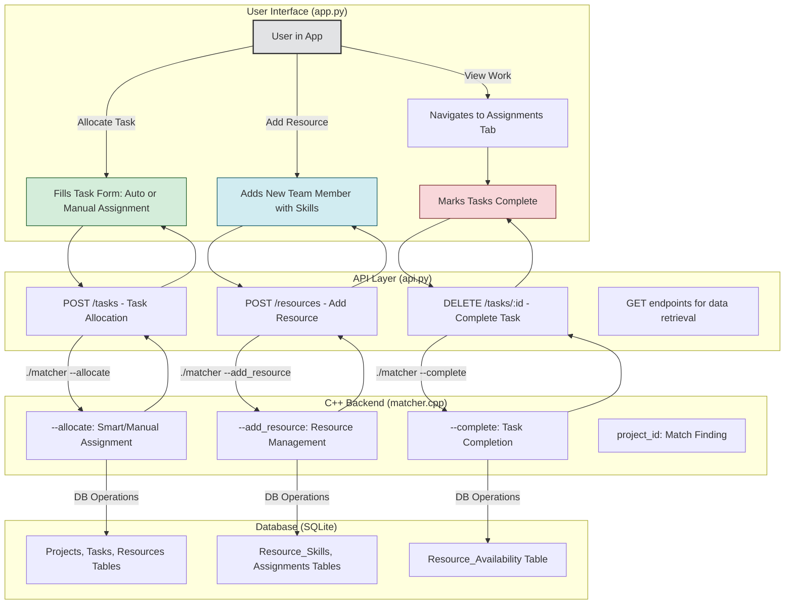

# Intelligent Task Manager

An advanced resource management and task allocation system featuring a high-performance C++ backend, a Python (SQLite) API layer, and an interactive web dashboard built with Streamlit.

This project demonstrates a multi-language, 3-tier architecture designed for smart task management. It features both intelligent automated allocation and flexible manual assignment capabilities, allowing managers to choose between system-optimized resource allocation or direct manual control.

---

## Key Features

* **3-Tier Architecture**: A clear separation of concerns with a Streamlit frontend (Presentation), a Python API (Business Logic), and a C++ backend (Core Logic/Data Layer) for maintainability and performance.
* **Dual Allocation Modes**: 
  - **Smart Auto-Assignment**: A two-priority algorithm that first seeks completely free resources and then assigns tasks to the least busy qualified resource
  - **Manual Assignment**: Direct control to assign tasks to specific resources with skill validation
* **Dynamic Resource Management**: Add new team members with their skills through the web interface, with automatic availability setup
* **Real-Time Task Management**: Allocate new tasks, create projects on the fly, and view active assignments with live updates
* **Task Completion & History**: Complete tasks with one click to instantly free up resources while maintaining a comprehensive audit trail
* **Interactive Web Dashboard**: User-friendly Streamlit interface with intuitive navigation and real-time feedback

---

## Architecture Diagram

The application follows a classic 3-tier architecture with enhanced resource management capabilities.



## Steps to Run Locally

Follow these steps to get the project running on your local machine.

### Prerequisites

You will need the following software installed on your system. These instructions are for Debian/Ubuntu-based Linux distributions.

* **C++ Compiler (g++)**
    ```sh
    sudo apt-get update
    sudo apt-get install build-essential g++
    ```
* **SQLite3 Development Library**
    ```sh
    sudo apt-get install libsqlite3-dev
    ```
* **Python 3 and Pip**
    ```sh
    sudo apt-get install python3 python3-pip
    ```
* **nlohmann/json C++ Library**
    Download the single header file into the project directory.
    ```sh
    wget https://github.com/nlohmann/json/releases/download/v3.11.2/json.hpp
    ```

### Setup and Installation

1.  **Clone the Repository**
    ```sh
    git clone https://github.com/Opollo11/intelligent-resouce-manager.git
    cd intelligent-resouce-manager
    ```

2.  **Install Python Libraries**
    ```sh
    pip install streamlit requests pandas
    ```

3.  **Compile the C++ Backend**
    Make the compilation script executable and run it. This will create the `matcher` executable.
    ```sh
    chmod +x compile.sh
    ./compile.sh
    ```

### Running the Application

Run the API server and the Streamlit frontend in **two separate terminal windows**.

1.  **Start the Python API Server (Terminal 1)**
    This command starts the backend server, which will automatically create and set up the database using the C++ executable.
    ```sh
    python3 api.py
    ```
    You should see output indicating the server is running on port 8000.

2.  **Run the Streamlit Web App (Terminal 2)**
    This command starts the frontend web application.
    ```sh
    streamlit run app.py
    ```
    Streamlit will automatically open a new tab in your web browser with the application dashboard.

## Detailed Overview

### Project Structure

```text
├── app.py                  # The Streamlit frontend UI with enhanced forms
├── api.py                  # The Python backend API with resource management
├── matcher.cpp             # The C++ core logic with manual assignment support
├── compile.sh              # Compilation script for C++ code
├── json.hpp                # The nlohmann JSON library for C++
└── resource_matching.db    # The SQLite database file (auto-generated)
```

### Functionality

The application is organized into four comprehensive tabs:

1.  **Project Task Matching**: View potential resource matches for existing project tasks. This provides a strategic overview showing all qualified and available resources for each unassigned task, helping with high-level resource planning and project feasibility assessment.

2.  **Allocate New Task**: The core interactive feature with enhanced capabilities:
    - **Project Management**: Create new projects or select existing ones
    - **Task Definition**: Specify task details including name, required skill, and duration
    - **Assignment Options**: Choose between intelligent auto-assignment (recommended) or manual resource selection
    - **Resource Management**: Add new team members with their skills directly through an expandable form
    - **Skill Validation**: Automatic verification that manually selected resources have required skills

3.  **View & Complete Assignments**: Real-time dashboard of active work:
    - Live view of all current task assignments organized by resource
    - Task details including duration, project, and schedule information  
    - One-click task completion with immediate resource liberation
    - Instant UI updates and success notifications

4.  **Completion History**: Comprehensive audit trail:
    - Complete historical record of all finished tasks
    - Resource performance tracking with completion dates
    - Project completion insights and team productivity metrics
